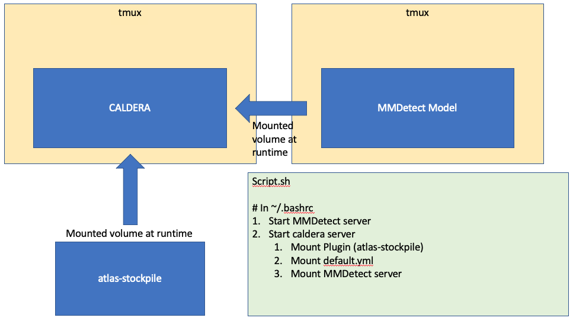

# ATLAS plugin: **Arsenal**

### This plugin will help store and create adversarial TTPs defined in [`ATLAS`](https://atlas.mitre.org/) to interfeace with [`CALDERA`](https://github.com/mitre/caldera). It can be used in conjuction with the plugin [`Almanac`](https://gitlab.mitre.org/advml/almanac/-/tree/develop). This is a mirror of the public repo: [`stockpile`](https://github.com/mitre/stockpile/tree/master) on its `master` branch


- Do **NOT** push any code to `master` branch, this branch is reserved for pulling changes from the `stockpile` repo

- **All code relevant to `arsenal` that is not a development branch should be pushed to `main`**

# Developers
## Installation with CALDERA app

- follow guide for setting up the `arsenal` repo in SETUP Help

## HARBOR: docker images
We recommend using the container-manager resources for development, which includes a host of pre-built docker images. The images most used with this plugin will be:
 - caldera-dev:latest
 - mmdet-serve:retinanet

To request access to Harbor, navigate to: `butler.mitre.org/harbor`

 - Use your MITRE SUI and password to login
 - Navigate to the `ATLAS` project page (you must be given access first)
    
Use the ```PULL``` tab to copy the command or pull directly using the `TAG`:

```
docker pull butler.mitre.org/atlas/<IMAGE>:<TAG>
```

You must periodically login into Harbor to pull new images and push new images (only certain users will be able to push to the atlas folder for obvious reasons). To login, in your terminal:

```code

docker login butler.mitre.org
 >>> MITRE SUI
 >>> MITRE Password

```

### It is recommended to edit your `.bashrc` to instantiate a docker container with the `atlas-stockpile` plugin mounted to CALDERA container

To do so, run the following bash script, which will:
```code 
script.sh
```

- install tmux
- edit `.bashrc` with the docker run command inside a persistent `tmux` session named "caldera"

### Run the MMDETECTION (or Target) Model:
```
docker run -d -p <port>:<port> butler.mitre.org/atlas/mmdet-serve:retinanet
```
## Mounting a different/additional plugin
### Mounting to the CALDERA docker container allows for dynamic changes to the plugin in the container to be seen.
### Be sure to clone the repo of the plugin you want to include into `/home/username/`

To mount other plugins not shipped with the CALDERA codebase simply add the following to the bash script and re-run:

```
-v /path/to/plugin:/usr/src/app/plugins/plugin
```

**Currently only the atlas-stckpile and almanac plugins are supported** 

# Arsenal Setup Help
To `fetch` new changes to the original stockpile repo:

```
# If you want, add the original repo as remote to fetch (potential) future changes. 
# Make sure you also disable push on the remote (as you are not allowed to push to it anyway)

git checkout master
git remote add upstream https://github.com/mitre/stockpile.git
git remote set-url --push upstream DISABLE

```

You can list all your remotes with:
```
git remote -v
```
You should see:
```
origin  git@gitlab.mitre.org:advml/atlas-stockpile.git (fetch)
origin  git@gitlab.mitre.org:advml/atlas-stockpile.git (push)
upstream        https://github.com/mitre/stockpile.git (fetch)
upstream        DISABLE (push)

```

**When you push, do so on origin with:**
```
 git push origin
 ```

 When you want to pull changes from upstream you can just fetch the remote and rebase on top of your work:
 ```
  git fetch upstream
  git rebase upstream/master

 ```

 Overview of how this code base works:



# CALDERA plugin: Stockpile

A plugin supplying CALDERA with TTPs and adversary profiles.

[Read the full docs](https://github.com/mitre/caldera/wiki/Plugin:-stockpile)

For collection and exfiltration abilities added January 2022 (see list below), additional information
for configuring these abilities can be found in the [examples](docs/Exfiltration-How-Tos.md) in the stockpile/docs/ 
folder.

*2022 Included abilities:*
- Advanced File Search and Stager
- Find Git Repositories & Compress Git Repository
- Compress Staged Directory (Password Protected)
- Compress Staged Directory (Password Protected) and Break Into Smaller Files
- Exfil Compressed Archive to FTP
- Exfil Compressed Archive to Dropbox
- Exfil Compressed Archive to GitHub Repositories | Gists
- Exfil Compressed Archive to GitHub Gist
- Exfil Directory Files to Github (this exfiltrates files without archiving)
- Exfil Compressed Archive to S3 via AWS CLI
- Transfer Compressed Archive to Separate S3 Bucket via AWS CLI
- Scheduled Exfiltration
