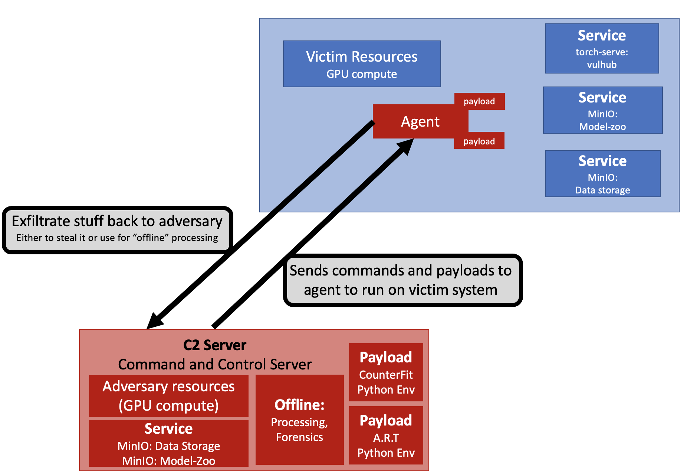

# ARSENAL

## `ARSENAL` is a Machine Learning (ML) plugin to the platform [`CALDERA`](https://github.com/mitre/caldera), that implements Tactics, Techniques, and Procedures (TTPs) specific to ML operations described in [`MITRE ATLAS`](https://atlas.mitre.org/).

---

## Included ML Libraries

---
### Arsenal implements modern ML libraries for adversarial ML development including:

 - [`Counterfit`](https://github.com/Azure/counterfit) - which wraps [`Adversarial Robustness Toolbox (ART)`](https://github.com/Trusted-AI/adversarial-robustness-toolbox), [`TextAttack`](https://github.com/QData/TextAttack), and [`Augly`](https://github.com/facebookresearch/AugLy)

 - [`Vulhub`](https://github.com/vulhub/vulhub) - deploy vulnerable environments via docker
 - [`torch-serve`](https://pytorch.org/serve/) - serve any type of model to emulate / red-team
 - [`MinIO`](https://github.com/minio/minio) - deploy object stores and S3 buckets to immitate a victim system hosting data and/or models
 - [`Almanac`](https://github.com/mitre-atlas/almanac) - generate adversary layers (sequences of operations) based on MITRE ATLAS TTPs.
---

## Emulation Diagram
---

### Arsenal allows users to perform red teaming emulation on internal and external systems using a variety of platforms (linux, windows, etc.) via CALDERA in conjunction with cybersecurity-based plugins and TTPs.

There is a moderate amount of setup for a user to configure `ARSENAL` for their own personal needs. Off the shelf Abilities and Adversaries are provided, and further instructions are provided for using a mix of automated capabilities and manual commands.

The following diagram illustrates the basic usage of the Arsenal plugin within CALDERA:

---

## Developers

---

If you are a developer and looking to contribute to `ARSENAL` or modify it for your needs, please navigate to the [`developers page`](https://advml.pages.mitre.org/arsenal/dev.html).

Currently, `ARSENAL` is not a default plugin within `CALDERA`, and therefore additional setup to integrate with the app is required.
